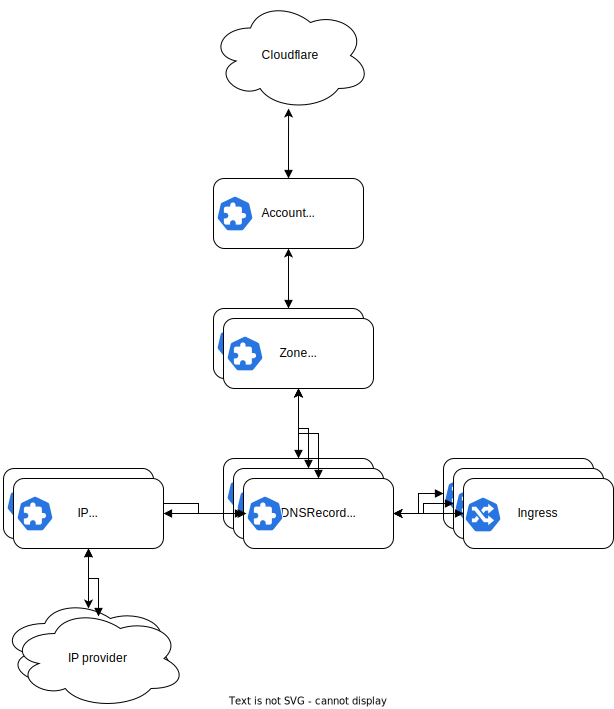

# Core Concept

The goal of cloudflare-operator is to manage Cloudflare DNS records using Kubernetes objects.

## Architecture



## Preamble Cloudflare DNS Record

A Cloudflare DNS record has the following fields:

### Type

Cloudflare can handle multiple types. At the moment cloudflare-operator only supports `A` and `CNAME` records.

**A**

An `A` record must point to a valid IPv4 address (e.g. `172.4.20.69`).

!!! info "cloudflare-operator use case"
    Let cloudflare-operator create an `A` record for your root domain (e.g. `example.com`).

**CNAME**

A `CNAME` record must point to a valid domain (e.g. `example.com`).
Cloudflare has the ability to point a `CNAME` record to an `A` record. `Proxy Status` and `TTL` of the `CNAME` record will be passed to the `A` record.

!!! info "cloudflare-operator use case"
    Let cloudflare-operator create `CNAME` records for all your subdomains that point to your `A` record root domain.  
    This is not mandatory but recommended, since cloudflare-operator only has to change one DNS record if your external IPv4 address changes.

### Name

Must be a valid domain or subdomain (e.g. `example.com` or `blog.example.com`).

### Content

If type is `A`, the content must be a valid IPv4 address.  
If type is `CNAME`, the content must be a valid domain.

!!! info "cloudflare-operator use case"
    Our recommendation is to point all your subdomains to your root domain (e.g. `example.com`).

### Proxy Status

Since Cloudflare is not only a DNS provider, it also has the ability to proxy requests through its CDN.  
This feature also enables WAF (web application firewall) protection.  
The `proxied` field is used to enable or disable this feature.

### TTL

TTL (time to live) is a setting that tells the DNS resolver how long to cache a query before requesting a new one.

### Example

| Type  | Name        | Content       | Proxy Status | TTL  |
| :---- | :---------- | :------------ | :----------- | :--- |
| A     | example.com | 178.4.20.69   | true         | Auto |
| CNAME | www         | example.com   | true         | Auto |
| A     | blog        | 142.251.36.35 | true         | Auto |
| CNAME | vpn         | example.com   | false        | 120  |

- `www.example.com` is hosted on your server at home with your external IPv4 address `178.4.20.69`.  
- `blog.example.com` is hosted on a cloud provider instance with the IPv4 address `142.251.36.35`

## Account

The `Account` object contains your Cloudflare credentials (email & global API key) and owns `Zone` objects.

Example:

```yaml
apiVersion: cf.containeroo.ch/v1beta1
kind: Account
metadata:
  name: account-sample
spec:
  email: mail@example.com
  globalAPIKey:
    secretRef:
      name: global-api-key
      namespace: default
  # managedZones:
  #   - example.com
  #   - other.com
```

If cloudflare-operator should only manage some zones, you can specify them in the `managedZones` field.

### Self-Healing

The `Account` controller reconciles itself in the given interval, if an error occurs. See the following table:

| error                                                 | interval |
| :---------------------------------------------------- | :------- |
| referenced secret (`secretRef`) not found             | 30s      |
| `apiKey` in referenced secret (`secretRef`) not found | 30s      |
| connection to Cloudflare                              | 30s      |
| fetching zones from Cloudflare                        | 30s      |
| fetching zones from `Zone` object                     | 30s      |

## Zone

The `Zone` object stores the zone id. This object will be automatically created by cloudflare-operator based on the zones available in the Cloudflare account.  
If a zone is not in the `Account.spec.managedZones` field, it will not be managed by cloudflare-operator.

cloudflare-operator checks if a given `DNSRecord.spec.name` ends with `Zone.spec.name` to evaluate in which Cloudflare zone the dns record should be created.

cloudflare-operator will fetch in the given interval (`spec.interval`) all Cloudflare DNS records for each `Zone` object and deletes them on Cloudflare if they are not present in Kubernetes. The interval will be inherited from `Account.spec.interval`.

Example:

```yaml
apiVersion: cf.containeroo.ch/v1beta1
kind: Zone
metadata:
  name: example-com
spec:
  id: abcdef123456
  name: example.com
```

### Self-Healing

The `Zone` controller reconcile itself in the given interval, if an error occurs. See following table:

| error                                                | interval |
| :--------------------------------------------------- | :------- |
| `apiKey` in secret from `Account.secretRef` is empty | 5s       |
| fetching zones from Cloudflare                       | 30s      |
| fetching `DNSRecord` objects                         | 30s      |
| fetching DNS records from Cloudflare                 | 30s      |

## IP

The `IP` object has two purposes:

1. **DRY (Don't Repeat Yourself)**

    Let's say you have multiple `DNSRecords` pointing to the same IP. You can use the `IP` object to avoid repeating the IP address in the `DNSRecord.spec.content` field.  
    If you change the `IP` object, cloudflare-operator will automatically update the `DNSRecord.spec.content` fields.

    Example:

    ```yaml
    apiVersion: cf.containeroo.ch/v1beta1
    kind: IP
    metadata:
      name: static-address
    spec:
      type: static
      address: 142.251.36.35
    ```

2. **Dynamic DNS**

    If the `type` is set to `dynamic`, cloudflare-operator will fetch your external IPv4 address in a specified interval (`spec.interval`).

    Example:

    ```yaml
    apiVersion: cf.containeroo.ch/v1beta1
    kind: IP
    metadata:
      name: external-ipv4
    spec:
      type: dynamic
      interval: 5m
    ```

    If no `dynamicIPSources` are specified, cloudflare-operator will use a hardcoded set of sources.  
    If you prefer other sources, you can add them as a list in `dynamicIPSources`.

    Example:

    ```yaml
    apiVersion: cf.containeroo.ch/v1beta1
    kind: IP
    metadata:
      name: external-ipv4
    spec:
      type: dynamic
      dynamicIPSources:
        - https://api.ipify.org
      interval: 5m
    ```

    !!! warning
        The source must return only the external IPv4 address.

        Good example:

        ```bash
        curl https://api.ipify.org
        ```

        Output:

        ```console
        142.251.36.35
        ```

        Bad example:

        ```bash
        curl "https://api.ipify.org?format=json"
        ```

        Output:

        ```console
        {"ip":"142.251.36.35"}
        ```

    !!! tip
        To minimize the amount of traffic to each IP source, make sure to add more than one `dynamicIPSources`. cloudflare-operator will randomly choose a source on every `interval`.

## Ingress

cloudflare-operator creates a `DNSRecord` for each host specified in an `Ingress` object.
You must set either the annotation `cf.containeroo.ch/content` or `cf.containeroo.ch/ip-ref`.
To skip the creation of a `DNSRecord`, add the annotation `cf.containeroo.ch/ignore=true`.

The following annotations are supported:

| Annotation                   | Value                  | Description                                                                                                                                 |
| :--------------------------- | :--------------------- | :------------------------------------------------------------------------------------------------------------------------------------------ |
| `cf.containeroo.ch/content`  | IPv4 address or domain | IPv4 address or domain to set as Cloudflare DNS record content                                                                              |
| `cf.containeroo.ch/ttl`      | `1` or `60`-`86400`    | Time to live, in seconds, of the Cloudflare DNS record. Must be between 60 and 86400, or 1 for 'automatic'                                  |
| `cf.containeroo.ch/type`     | `A` or `CNAME`         | Cloudflare DNS record type                                                                                                                  |
| `cf.containeroo.ch/interval` | `5m`                   | Interval at which cloudflare-operator will compare the Cloudflare DNS record with the `DNSRecord` object and reconcile the DNSRecord object |
| `cf.containeroo.ch/ignore`   | `true` or `false`      | Skip creation of a DNS record                                                                                                               |

!!! note "cf.containeroo.ch/ignore"
    If you add the label `cf.containeroo.ch/ignore=true` and cloudflare-operator has already created a `DNSRecord`, cloudflare-operator will clean up the `DNSRecord` (Kubernetes and Cloudflare).

!!! note "cf.containeroo.ch/interval"
    This interval as two purposes:  
    1. It specifies at which interval cloudflare-operator will fetch the DNS record from Cloudflare and compare it with the `DNSRecord` object spec. If the DNS record does not match the spec, cloudflare-operator will update the DNS record on Cloudflare.  
    2. Interval at which cloudflare-operator will check if the corresponding `DNSRecord` object still exists. If it does not exist, cloudflare-operator will recreate the `DNSRecord` object.  
    If not specified, cloudflare-operator will use a default interval of 5 minutes.

Example:

```yaml
apiVersion: networking.k8s.io/v1
kind: Ingress
metadata:
  annotations:
    cf.containeroo.ch/content: example.com
  name: blog
  namespace: blog
spec:
  rules:
  - host: blog.example.com
    http:
      paths:
      - backend:
          service:
            name: blog
            port:
              name: http
        path: /
        pathType: Prefix
```

!!! warning "apiVersion"
    cloudflare-operator can only fetch ingresses with `apiVersion` `networking.k8s.io/v1`.
    Older `apiVersions` like `extensions/v1beta1` or `networking.k8s.io/v1beta1` are not supported!

### self-healing

The `Ingress` controller reconcile itself in the given interval, if an error occurs. See following table:

| error                        | interval |
| :--------------------------- | :------- |
| fetching `DNSRecord` objects | 30s      |

## DNSRecord

DNSRecords represent a Cloudflare DNS record within Kubernetes.

`interval` specifies, at which interval cloudflare-operator will fetch the DNS record from Cloudflare and compare it with `DNSRecord` object spec (`proxied`, `ttl`, `type`, `content`). If the Cloudflare DNS record does not match the `DNSRecord`, the DNS record will be updated on Cloudflare.  
Default `interval` is set to 5 minutes.  
Therefore, the Kubernetes API can be looked at as a single source of truth.

If a `DNSRecord` is deleted, cloudflare-operator will also delete the corresponding Cloudflare DNS record.

Example:

```yaml
apiVersion: cf.containeroo.ch/v1beta1
kind: DNSRecord
metadata:
  name: www-example-com
  namespace: www
spec:
  name: www.example.com
  content: example.com
  type: CNAME
  proxied: true
  ttl: 1
  interval: 5m
```

Set `spec.ipRef` to the name of an `IP` object to automatically update the `content` with the address (`spec.address`) of the linked `IP` object.

Example:

```yaml
apiVersion: cf.containeroo.ch/v1beta1
kind: DNSRecord
metadata:
  name: blog-example-com
  namespace: blog
spec:
  name: blog.example.com
  type: A
  ipRef:
    name: static-address
  proxied: true
  ttl: 1
  interval: 5m
```

### self-healing

The `DNSRecord` controller reconciles itself in the given interval, if an error occurs. See the following table:

| error                                                          | interval |
| :------------------------------------------------------------- | :------- |
| `apiKey` in secret from `Account.secretRef` is empty           | 5s       |
| fetching zones from Cloudflare                                 | 30s      |
| `Zone.name` in Cloudflare not found                            | 30s      |
| `Zone` object not ready                                        | 5s       |
| fetching zones from Cloudflare                                 | 30s      |
| fetching DNS records from Cloudflare                           | 30s      |
| referenced `IP` object (`DNSRecord.spec.IPRef.name`) not found | 30s      |
